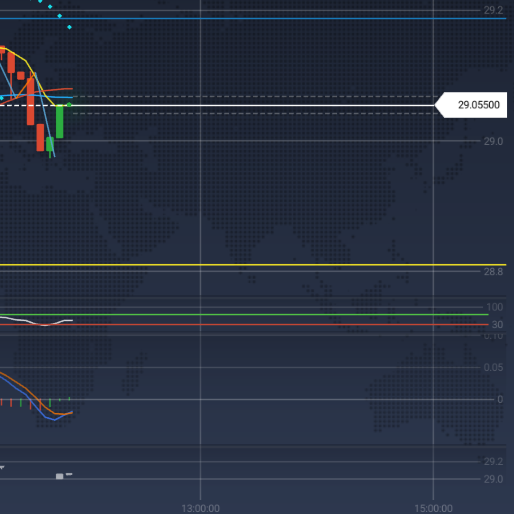
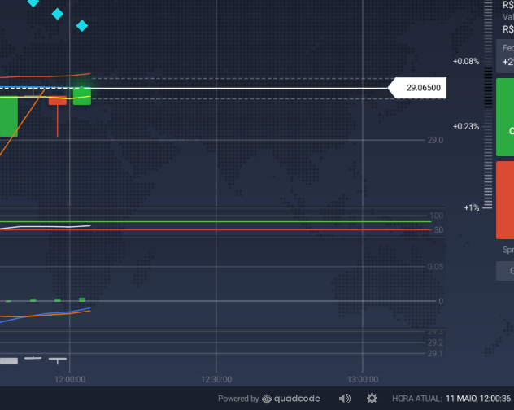

 

<H1>Gemini laboratório</H1>

Victor Barros

  
 
## Previsão de Valores com Gemini
 
SOMENTE PARA USO COM FINS ACADÊMICOS!!!

Este projeto tem como objetivo criar um modelo de previsão de valores com base em dados históricos usando técnicas de séries temporais. 
 
 
## Tecnologia 
 
Aqui estão as tecnologias usadas neste projeto
 
 * Python com as seguintes bibliotecas:
    - import os # FOR SYSTEM COMMANDS
    - import pathlib #para manipulação de caminhos de sistema de arquivos
    - import textwrap #É especialmente útil para formatação de saída de texto em interfaces de linha
    - import numpy as np # PARA OPERACOES MATEMATICAS (sqrt, abs,...)
    - import pandas as pd # PARA MANIPUTACAO DE DADOS CSV
    - import google.generativeai as genai # PARA UTLIZAR O GEMINI
    - from pathlib import Path import hashlib #para cálculo de hashes seguros e resumos de mensagens.
    - from google.colab import userdata # PARA RECUPERAR O GOOGLE_API_KEY
    - from IPython.display import display
    - from IPython.display import Markdown
    - from sklearn.linear_model import LinearRegression
    - from google.colab import data_table # PARA FORMATAÇÃO DAS TABELAS DO COLAB

 
## Serviços usados
 
* Google Colab Notebook
 
 
## Como usar
 
Abra o Google Colab Notebooks: https://colab.research.google.com/drive/1ZqX9SHqcRmn2RPC2bVPPQwBufXyWZuiQ?authuser=0#scrollTo=Io4_kLs-URlW

 
## Resultados

### 11:45

### 12:00

 
 
## Conclusão

Mesmo considerando o pequeno tamanho da série temporal do conjunto de dados as duas previsões foram 
aproximadamente corretas.  
Nossa conclusão é que os dados disponibilizados apresentam a utilização do Google Gemini, 
porem a baixa quantidade amostras pode vir a prejudicar a acuracia do classificador.
 
## Melhorias

* Utilizar as seguintes bibliotecas:
    - tensorflow #PARA REDE NEURAL
    - keras #PARA REDE NEURAL

* Aquisição dos dados por Streaming
 
## Links
 
  - Artigo: https://github.com/vicssb/Artificial-intelligence-in-INPE---2022/blob/master/Analise%20de%20dados%20estatisticos%20dos%20satelites%20Sentinel%201%20.pdf
  
  - Repositório: https://github.com/vicssb/lab_asset_forecast
    - Em caso de bugs sensíveis, como vulnerabilidades de segurança, entre em contato
      diretamente em vez de usar o rastreador de problemas. Valorizamos o seu esforço
      para melhorar a segurança e privacidade deste projeto!
 
 
## Versão
 
1.0.0.0
 
 
## Autor
 
* **Victor Barros**: 

- @vicssb (https://github.com/vicssb)
- vicssb@gmail.com
 

  

  

  

  
  

Por favor, siga o github e junte-se a nós!
Obrigado por me visitar e boa codificação!

