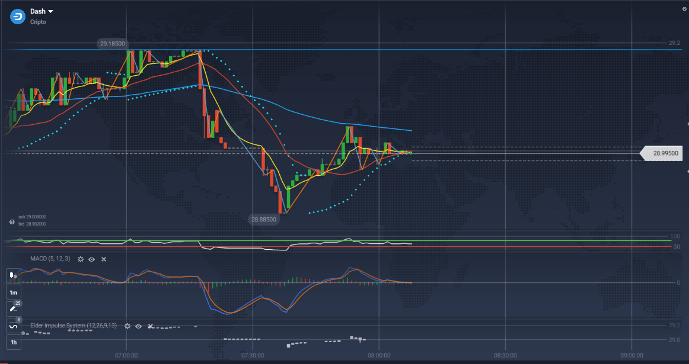

 

<H1>Gemini Lab</H1>

Victor Barros

 

## Value Forecasting with Gemini

FOR ACADEMIC USE ONLY!!!

This project aims to create a value forecasting model based on historical data using time series techniques.
 
## Technology

Here are the technologies used in this project:

- Python with the following libraries:
    - `os` for system commands
    - `pathlib` for file system path manipulation
    - `textwrap` (useful for text formatting in command-line interfaces)
    - `numpy` for mathematical operations (e.g., sqrt, abs, ...)
    - `pandas` for CSV data manipulation
    - `google.generativeai` for utilizing Gemini
    - `hashlib` for secure hash calculation and message digests
    - `user_data` from Google Colab to retrieve the `GOOGLE_API_KEY`
    - `display` and `Markdown` from IPython for displaying formatted content
    - `LinearRegression` from `sklearn` for linear regression
    - `data_table` from Google Colab for table formatting
 
## Services Used
 
* Google Colab Notebook
 
 
## How to use
 
Open Google Colab Notebooks: https://colab.research.google.com/drive/1ZqX9SHqcRmn2RPC2bVPPQwBufXyWZuiQ?authuser=0#scrollTo=Io4_kLs-URlW
 
## Results

### 11:45

### 12:00

 ## Conclusion

Despite the small size of the time series dataset, both predictions were approximately correct. Our conclusion is that the provided data demonstrates the use of Google Gemini, but the low sample quantity may impact the classifier's accuracy.

## Improvements

- Utilize the following libraries:
    - `tensorflow` for neural networks
    - `keras` for neural networks

- Stream data acquisition
 
## Links
 
  - Article: https://github.com/vicssb/Artificial-intelligence-in-INPE---2022/blob/master/Analise%20de%20dados%20estatisticos%20dos%20satelites%20Sentinel%201%20.pdf
  
  - Repository: https://github.com/vicssb/lab_asset_forecast
    - In case of sensitive bugs like security vulnerabilities, please contact
      YOUR EMAIL directly instead of using issue tracker. We value your effort
      to improve the security and privacy of this project!
 
 
## Versioning
 
1.0.0.0
 
 
## Authors
 
* **Victor Barros**: 

- @vicssb (https://github.com/vicssb)
- vicssb@gmail.com
 

  

  

  

  
  

Please follow github and join us!
Thanks for visiting and happy coding!

